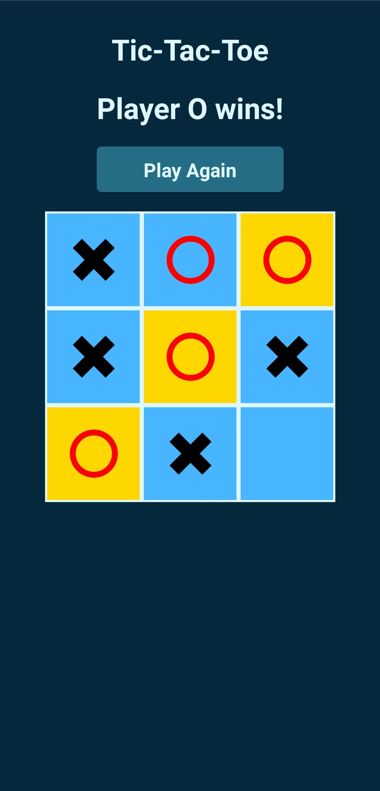

# Tic Tac Toe (React Native) 🎮

Welcome to the Tic Tac Toe game built using React Native! This is a simple and fun two-player game where you can challenge your friends to see who is the ultimate Tic Tac Toe champion. 😎

# How to Play 🕹️

- Install the game on your Android or iOS device.

- Launch the game and you will be greeted with the Tic Tac Toe board.

- Player 1 starts the game by tapping on any empty cell on the board. Player 1's marker is 'X', and Player 2's marker is 'O'.

- Alternate turns between players, tapping on an empty cell each time.

- The game continues until one player successfully aligns three of their markers either horizontally, vertically, or diagonally.

- If all cells are filled without any player achieving three markers in a row, the game ends in a draw.

- Celebrate your victory or gracefully accept your defeat! 🎉

# Installation 📲

1. clone the repo

```bash
git clone https://github.com/MohamedKamalOthman/TicTacToe
```

2. cd into the project directory

```bash
cd TicTacToe
```

3. Install dependencies

```bash
npm install
```

4. Connect your phone or emulator and run the app

```bash
npm start
```

# Screenshots 📷



# Demo video 📹


https://github.com/MohamedKamalOthman/TicTacToe/assets/76039756/5f733e07-b3e6-4b17-85a0-05a205270700

